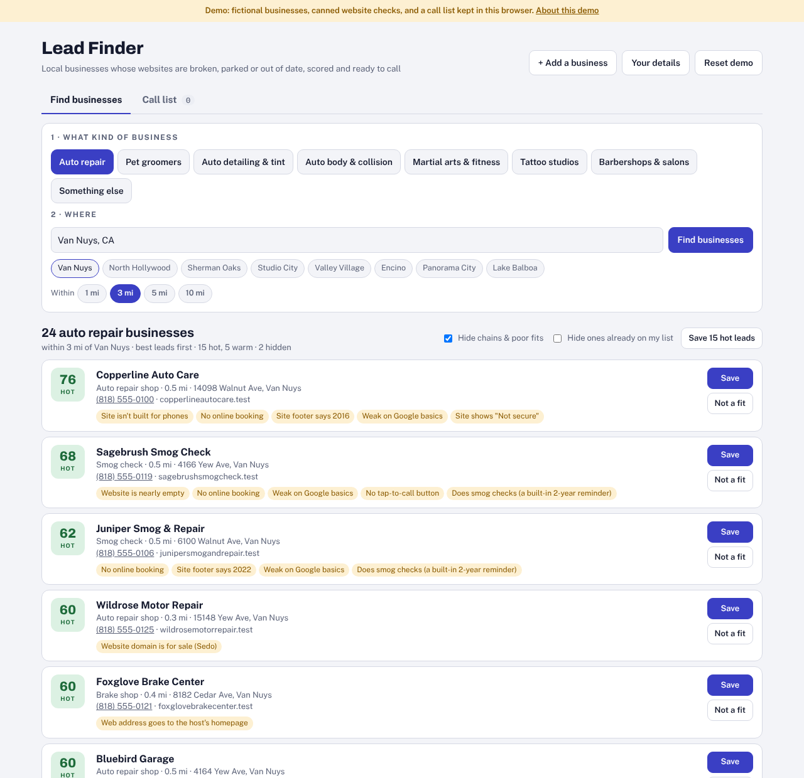
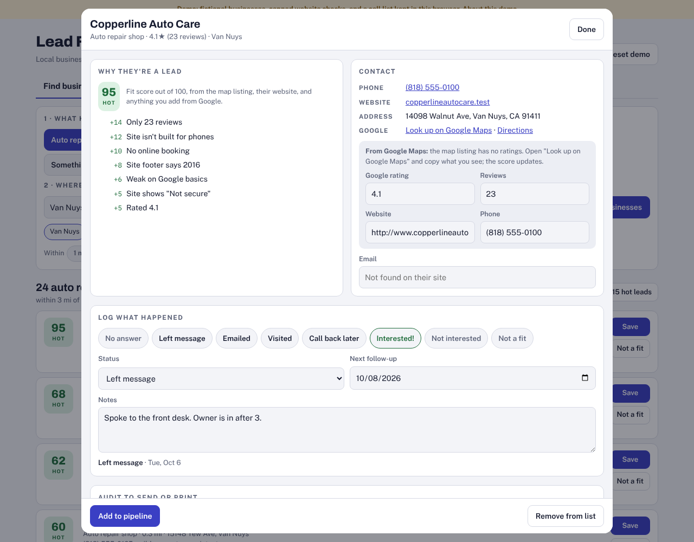
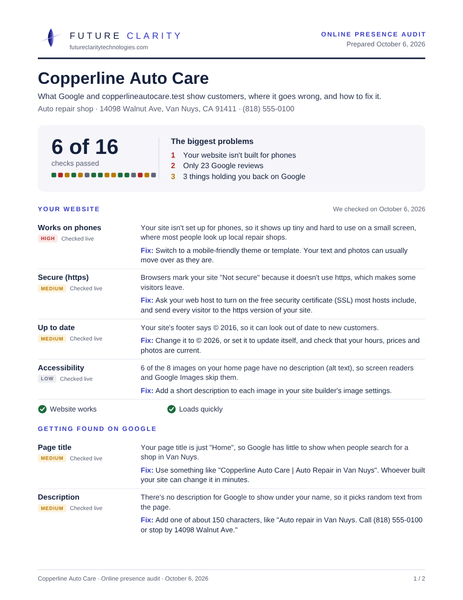
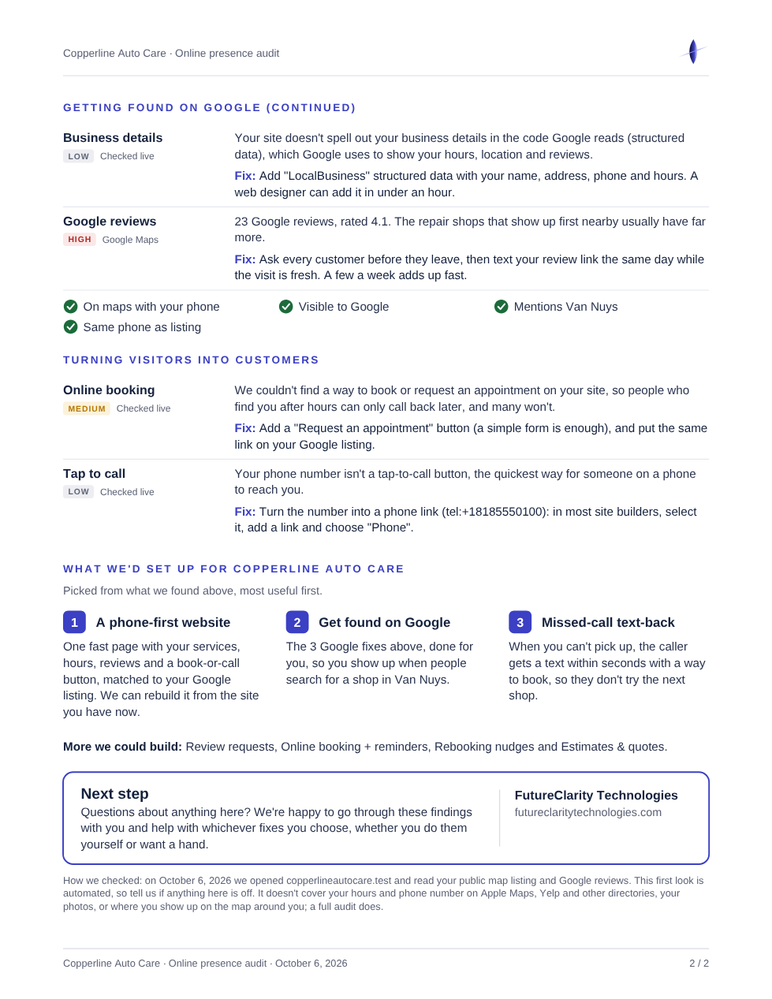
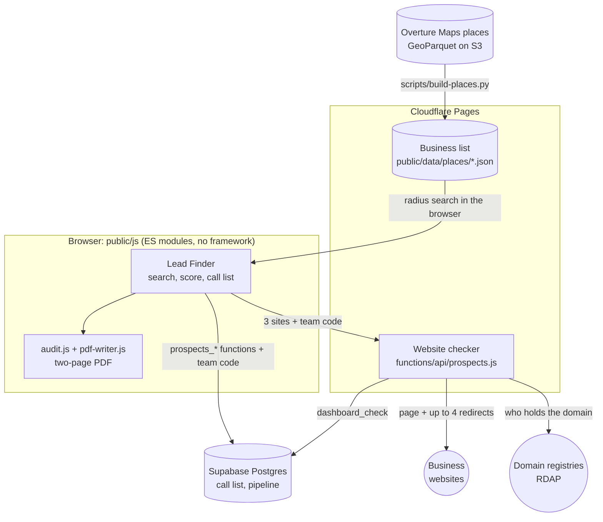

# Lead Finder

A small web agency gets its best leads from local businesses whose websites have quietly stopped working: the domain lapsed and now shows a parking page, a reseller put it up for sale, the hosting plan ended, the site was never connected, or it still runs a 2016 template that is hidden from Google. Lead Finder finds those businesses near a point on the map, checks every website, scores each business as a lead, keeps a call list, and writes a two-page PDF audit the owner can act on.

I built it as an internal tool for [FutureClarity Technologies](https://futureclaritytechnologies.com), my web agency in the San Fernando Valley, Los Angeles. This repository is that tool extracted into a standalone project. The live version and its data are internal and not public; this one runs as a self-contained demo with fictional businesses.



**Try it:** `npm install && npm run dev`, then open http://127.0.0.1:8788. More under [Running the demo](#running-the-demo).

## What it does

1. **Find.** Pick a kind of business (auto repair, groomers, salons, ... or anything typed in), a neighborhood, city or ZIP code, and a radius of 1 to 10 miles. The search runs in the browser over a business list served with the site, built from [Overture Maps](https://overturemaps.org/) open data. No server, API key or account is involved.
2. **Check.** For each website it decides first whether there is a real website at all: a social or booking profile, a domain that is unregistered, expired, parked or for sale, a placeholder ("coming soon", a host's default page, "account suspended"), a site that answers with an error or takes too long, or a page that belongs to someone else now. For a real site it reads the search basics (title, description, `noindex`, structured data, whether the page names the business's area and phone), mobile and accessibility basics (viewport, blocked zoom, images without alt text), the copyright year, booking, tap-to-call, the site builder, and the booking, payment, chat and analytics tools it already uses.
3. **Score.** Each business gets a fit score from 0 to 100 from its listing, its website check and anything typed in from Google Maps (rating and review count). Chains and franchises are hidden by default.
4. **Call list.** Save the good ones, log what happened on each call (the next follow-up date is set for you), keep notes, export a CSV, and hand interested businesses to the team's sales pipeline.
5. **Audit.** Download a two-page PDF for the owner: what was checked, every problem with its severity and a specific fix (naming their site builder or domain registrar when known), and what we would set up. It is generated in the browser by a PDF writer with no dependencies. For a day of visits, the whole call list goes into one PDF with a bookmark per business.

One business, saved to the call list: its score broken down by signal, what the website check found, and the call log.



Its audit, as downloaded ([the PDF itself](docs/screenshots/sample-audit.pdf)):

| Page 1 | Page 2 |
|---|---|
|  |  |

## How it fits together



- **`public/`** is the whole front end: plain ES modules and CSS, served as static files. `public/js/app/` holds the page (state, the Find view, the call list, the business panel); the modules beside it hold the logic the page and the tests share (`score.js`, `places.js`, `geo.js`, `audit.js`, `pdf-writer.js`, `store.js`), with brand and region settings in `config.js` only.
- **`functions/`** is one Cloudflare Pages Function, the website checker. A browser can't read another site's HTML, so this is the only part that needs a server.
- **`supabase/`** is the database: three tables (the call list, the pipeline, and the team code's hash) and the functions that guard them.
- **`scripts/`** builds the business list from Overture Maps, the demo's data, the Pages build, the screenshots and a benchmark.

## Working inside Cloudflare's free-plan limits

The checker runs on Cloudflare's free plan, which allows 50 subrequests and 10 ms of CPU time per invocation. Both limits shaped the code ([`functions/lib/site-check.js`](functions/lib/site-check.js)).

**50 subrequests.** Every `fetch` counts, and so does every redirect a `fetch` follows on its own. The checker:

- checks at most 3 sites per call (the browser runs two calls at a time);
- follows redirects by hand (`redirect: 'manual'`), at most `MAX_HOPS = 4` of them. Doing it by hand also lets it stop at the first hop that lands on a domain marketplace, a parking service, a host's homepage or a profile page, without loading that page;
- asks the domain registry (RDAP) only when the site didn't come through cleanly: one request for `.com` and `.net`, which go straight to Verisign, and two for other endings, since `rdap.org` redirects to the right registry;
- checks the team code once per call, and remembers a code that passed for 10 minutes per isolate (as a SHA-256 hash), so a search followed by several checks costs one database round trip.

The worst case is 3 × (1 page + 4 redirects + 2 registry requests) + 1 code check = 22 subrequests. A test asserts that budget, and another that a longer redirect chain stops after exactly 5 requests.

**10 ms of CPU.** Waiting on the network doesn't count; reading pages does.

- Pages are read through a stream reader that stops at 120,000 characters and cancels the rest of the download.
- The checker recognizes 164 vendor signatures: booking and shop software, site builders, analytics, chat, payments, forms and parking services. Instead of testing each one against the whole page, it pulls every linked host (plus the start of its path) out of the page in one regex pass, joins them with newlines, and runs all 164 signatures as a single compiled lookahead pattern, `(?=(sig1|sig2|...))`, longest first. The lookahead lets overlapping signatures all match (`img1.wsimg.com` and `wsimg.com/parking-lander` in the same link), and the newlines let a signature be anchored to the start or end of a link (`dan.com` should not match `jordan.com`).
- Every other scan has a cap: 300 candidate email addresses, 8 JSON-LD blocks, 500 images, 2,000 linked hosts.
- Hints about the business (its name, area and phone) are matched the same way: one pattern, one pass.

[`scripts/bench-checker.mjs`](scripts/bench-checker.mjs) measures this in Node 22 (same V8 engine, different hardware, so treat the numbers as a guide). On a 4-core Xeon VM, reading a typical home page took about 0.7 ms and a page at the 120 KB cap with 1,000 links about 1.8 ms; testing each signature as its own regex against that capped page took about 7.4 ms. The first check in a fresh isolate costs more, because V8 compiles the code and the patterns then.

A 401, 403 or 429 is reported as "blocked", not "broken": that's usually a bot filter, and the site works for people.

## Detecting dead and for-sale domains

Most stale website links in a business list fall into a handful of patterns, and the checker tests for them in order:

1. **The address isn't a website.** 31 kinds of profile and listing pages (Facebook, Instagram, Yelp, Booksy, Google's retired `business.site` pages, directories) are recognized from the host name alone, without fetching anything.
2. **A redirect gives it away.** A hop to one of 25 domain marketplaces and registrars (Afternic, Sedo, Dan.com, HugeDomains, GoDaddy, ...) means parked, and "for sale" when it's a marketplace or the path says so. A hop to a host's or builder's own homepage (`wix.com`, `squarespace.com`, ...) means the site isn't set up. `ww12.<same domain>` is how ad-parking services serve a parked domain.
3. **The page gives it away.** Parking-service scripts in the links, Google's AdSense-for-domains script, GoDaddy's one-line jump to `/lander`, sale wording near the top of a small page ("for sale" is only claimed when the page or the marketplace says so), and placeholder pages: a host's default page, "account suspended", "website expired", a builder's "not connected" page, "coming soon" (only when it's the whole page, not news on a real site), or nothing but the domain name.
4. **The registry explains it.** When the site is down, parked or a placeholder, an RDAP lookup tells "not registered to anyone" (anyone could buy it) from "expired" (on hold, in its redemption period, or past its expiry date) from "registered, but its nameservers belong to a parking service". The record also gives the registrar, so the audit can say "call Namecheap today".
5. **It's someone else's site now.** A full page that never mentions the business's distinctive name words or its trade ("transmission", "grooming") probably belongs to whoever bought the lapsed domain. A rebranded shop still mentions its trade, so it isn't flagged, and "not there" only counts when the whole page was read.

The demo shows every one of these. Its website checks were produced by running this checker against synthetic pages, redirects and registry records ([`scripts/build-demo-data.mjs`](scripts/build-demo-data.mjs)), for example:

| What the checker saw | What it reported | Demo business |
|---|---|---|
| a 302 to `afternic.com/forsale/...` | parked, for sale (Afternic) | Ridgeway Motor Works |
| no DNS; RDAP status "client hold, redemption period" | expired, about to be released | Bluebird Garage |
| no DNS; RDAP 404 | not registered | Harbor Light Auto Repair |
| no DNS; nameservers at `parkingcrew.net` | parked (ParkingCrew) | Saltgrass Auto Repair |
| "Welcome to nginx!" | placeholder: a host's default page | Firefly Muffler & Exhaust |
| a 301 to `squarespace.com` | placeholder: the host's homepage | Foxglove Brake Center |
| an attorney's page that never names the shop | someone else's site | Oakhollow Garage |
| a 403 | blocked by a bot filter (not "broken") | Kestrel Tire & Wheel |
| a redirect chain that never ends | broken: redirects in a loop | Quarry Road Garage |

## A PDF writer with no dependencies

[`public/js/pdf-writer.js`](public/js/pdf-writer.js) is about 200 lines and writes PDF 1.4 directly:

- **Objects and a cross-reference table with exact byte offsets.** Every character in the file is a single byte, so a string's length is its byte offset, and the xref table can point at each object precisely. The tests check every offset, the trailer and every stream length byte by byte, then open the file with pdf.js (Mozilla's PDF engine).
- **Measured text.** Text is set in Helvetica, one of the 14 fonts every PDF viewer has built in, so nothing is embedded and a page is a few KB. The writer carries Adobe's published glyph widths for the WinAnsi character set, so it wraps lines by their real width (and splits a long URL anywhere when it must). `clean()` folds text to what the font can show: NFKC turns styled letters into plain ones, accents the font lacks are dropped, and other scripts are left out of the page.
- **Drawing.** Rounded rectangles and circles are Bézier curves; the brand mark is two clipped paths filled with axial gradients; web addresses, emails and phone numbers in the text become link annotations.
- **Any language where it's allowed.** The document title and the bookmarks are UTF-16 strings, so a business name in another script survives there even though the page text can't show it.

[`public/js/audit.js`](public/js/audit.js) decides what the audit says and lays it out. Each check is a row with a status, a severity (HIGH, MEDIUM or LOW, from its weight), how it was checked ("Checked live", "Domain records", "Google Maps") and a fix written for that business: the setting to change in their site builder, the registrar to call, a page title and description written from facts we hold (name, trade, area, rating, phone). Recommendations skip anything a tool they already use does on its own.

An audit is always two pages, one sheet printed double-sided. The layout is measured before anything is drawn, and when everything won't fit, detail is dropped least-useful first: the Google listing checklist, then "More we could build" shrinks to one line, then it goes, then the fixes for the smallest problems. Across the demo's 142 businesses (as the tests build them, some with Google reviews typed in), 131 fit at full detail and 11 needed something dropped; the tests check that every one comes out at exactly two pages.

## Access control enforced in Postgres

The team signs in with one shared code rather than individual accounts, and the browser talks to Supabase with the project's publishable key, which is public by design. So the database, not the page, decides what that key can do ([`supabase/`](supabase/)):

- **The code is never stored, only its bcrypt hash,** in a one-row table with row-level security on and every privilege revoked from the API roles. `_dashboard_ok(code)` compares it with `pgcrypto`'s `crypt()`, ignoring capitals and spaces, and waits a second before saying no, to slow guessing. Only the functions below can call it.
- **Every read and write goes through a `SECURITY DEFINER` function** that checks the code first: `prospects_rows`, `prospects_save`, `prospects_update`, `prospects_delete`, `dashboard_rows`, `dashboard_add`. Each runs with `set search_path = ''` and schema-qualified names, so a caller can't slip in a look-alike table or function. Apart from the one exception below, the tables have no grants at all for the API roles.
- **The website's public request form can insert into the pipeline and do nothing else.** A column-level `GRANT INSERT (name, business, contact, website, needs)` plus a row-level-security check means the publishable key can add a request, can't set its status or notes, and can't read anything back, not even the row it just added.
- **Saving a business again refreshes its facts but never the team's work.** `prospects_save` is an upsert whose `ON CONFLICT` list updates the name, phone, website, check results and score, fills the email, area and kind of business only when empty, and leaves status, notes, follow-up dates and call history alone.

The SQL tests run all three files, twice, against a real Postgres (PGlite) set up like a Supabase project, with the API roles granted everything on new tables and functions by default, and then check from the `anon` role that each of the above holds.

## Data pipeline (Overture Maps GeoParquet)

[`scripts/build-places.py`](scripts/build-places.py) builds the business list from the [Overture Maps Foundation](https://overturemaps.org/)'s places theme, which publishes every place in the world as large GeoParquet files on S3, updated monthly.

- **It reads only what it needs, over HTTP.** It finds the latest release, opens each file with `fsspec` (8 MB range reads), and reads the row-group statistics in the Parquet footer. Only the row groups whose bounding boxes overlap the area are fetched, and only the 12 columns it uses; then rows outside the box are filtered out.
- **It keeps what's worth a call:** open places with a confidence of 0.35 or more, sorted into the page's kinds of business by Overture category; duplicates (the same name ignoring case and punctuation, and the same phone, or the same spot) dropped; the business's own website chosen over a social link; chains marked from their brand.
- **It writes compact files.** One JSON file per kind of business, each row an array in a fixed field order with its category stored once as an index, plus `meta.json` with the release, the area's box and the centers of its neighborhoods, cities and ZIP codes. Centers are medians, so a few mislabeled addresses across town don't move them.

The browser then searches a file by computing the haversine distance to every row; at a few thousand rows per file that needs no server or spatial index. The tests cover the pure parts of the pipeline (including the row-group selection against a real Parquet file) without the network.

**Data license.** The production business list is built from Overture Maps data, available under [CDLA-Permissive-2.0](https://cdla.dev/permissive-2-0/), which includes data from Meta, Microsoft, Foursquare and others; the app shows that credit under the results ([Overture's attribution guidance](https://docs.overturemaps.org/attribution/)). The demo in this repository contains no Overture data: every business in it is fictional.

## Security notes and threat model

What's protected is the call list and the pipeline: business contact details, notes about conversations, and website-form submissions.

- **A shared code, not per-user accounts.** Anyone with the code has full access, and there's no record of who changed what. Changing the code signs every device out. The one-second delay slows guessing per request, but there's no per-client rate limit, so the real protection is a long, random code. Per-user sign-in (Supabase Auth plus row-level security on the user) would be the next step for a bigger team.
- **The code lives in the browser's localStorage** once entered, so anyone with access to that browser profile has it, and so would any script injected into the page. That's why the page allows no inline script at all (`script-src 'self'`), and why everything taken from the business list or a scraped website is escaped before it goes into HTML (`esc()`), and only `http(s)` addresses become links (`safeUrl()`).
- **The checker fetches addresses it's given,** so it only answers when the team code checks out, only fetches `http(s)` URLs, reads at most 120 KB, and returns a summary, never the page itself.
- **The CSV export prefixes cells that start with `=`, `+`, `-` or `@`**, so a business name scraped from the web can't run as a spreadsheet formula.
- **Response headers** ([`public/_headers`](public/_headers)): a Content-Security-Policy with no `unsafe-inline` for scripts or styles, `connect-src` limited to this site and the Supabase project, `frame-ancestors 'none'`, HSTS, `Cross-Origin-Opener-Policy`, a Permissions-Policy that turns off camera, microphone, geolocation, payment and USB, `nosniff`, and `noindex` for the app and its data. The local dev server applies the same file, and the end-to-end test fails on any CSP violation.

## Limitations

- **The business list** has no ratings, reviews or hours, so those are typed in from Google Maps, and it can miss a website or a newer business ("No website found", never "no website").
- **The checker reads HTML as served and runs no JavaScript,** so a site that builds its page in the browser can look nearly empty. It sees one page, the home page.
- **Heuristics can be wrong.** A parked domain can be a business's own unused second domain; RDAP coverage varies by top-level domain; `registrable()` handles common two-part suffixes (`co.uk`) without the full public suffix list.
- **Some settings are regional:** the state abbreviation and the quick-pick areas live in [`public/js/config.js`](public/js/config.js), and the words the checker ignores in business names include Los Angeles place names.
- **The PDF fonts cover Western European letters only.**
- **The demo can't check a website you type in:** only the sample businesses have canned results.

## Running the demo

Requires Node 22.

```sh
npm install
npm run dev          # http://127.0.0.1:8788
```

`npm run dev` serves `public/` with the same headers Cloudflare will send. Any static server works too (`npx serve public`). With no Supabase settings the app runs in demo mode: the business list is fictional ([`scripts/build-demo-data.mjs`](scripts/build-demo-data.mjs) generates it), website checks are canned results from the real checker, and the call list is kept in your browser's storage. "Reset demo" clears it. Try typing a Google rating into a business, saving it, logging a call, and downloading its audit.

## Deploying with your own Supabase

1. **Database.** Create a Supabase project. In the SQL Editor, run [`supabase/schema.sql`](supabase/schema.sql), then [`dashboard_code.sql`](supabase/dashboard_code.sql), then [`prospects.sql`](supabase/prospects.sql). All three are safe to run again. Set the team code with the command at the top of `dashboard_code.sql`.
2. **Business list.** Set the area (`WEST, SOUTH, EAST, NORTH`) and the categories (`GROUPS`) in [`scripts/build-places.py`](scripts/build-places.py), then:
   ```sh
   pip install -r scripts/requirements.txt
   python scripts/build-places.py     # writes public/data/places/
   ```
   Update `REGION` in [`public/js/config.js`](public/js/config.js) to match, and the brand (name, website, phone) printed on audits.
3. **Cloudflare Pages.** Connect the repository with build command `npm run build` and output directory `dist`. Under Settings > Environment variables, set `SUPABASE_URL` and `SUPABASE_KEY` (the publishable key), and optionally `CHECK_USER_AGENT` (what websites see; say who you are). The build writes the first two into the page and the CSP; the website checker in `functions/` reads all three at runtime. The build refuses a secret or `service_role` key.
4. **Locally, against your project:** copy `.dev.vars.example` to `.dev.vars`, fill it in, then
   ```sh
   SUPABASE_URL=... SUPABASE_KEY=... npm run build
   npx wrangler pages dev dist
   ```

## Tests

```sh
npm test               # 144 unit tests (node:test), about 20 seconds
npm run test:e2e       # the demo in Chromium (npx playwright install chromium first)
pytest tests/python    # the data pipeline (pip install -r scripts/requirements.txt pytest)
npm run lint           # ESLint
```

- **The checker** against a fake `fetch`: profiles, marketplace and parking redirects, parking code, placeholders, each RDAP outcome and which registry is asked, bot filters, the redirect budget, the read cap (the download is cancelled), and what it reads from a real page. Plus the route: code checks, the 10-minute cache, input limits.
- **The score, the radius search and the data layer**, including the rule that saving a business again keeps the team's notes.
- **The PDF writer and the audit:** byte-level structure, then pdf.js for pages, bookmarks, text, links and document info; every demo business's audit is exactly two pages.
- **The SQL** on PGlite, as described above.
- **The build:** demo and live output, and the refusal of secret keys.
- **The demo data** stays fictional: 555-01xx phone numbers, `.test` domains, and a canned check for every website.
- **End to end:** Playwright drives the demo under the production headers (search, radius, scores, a business, saving, the call log, the PDF download, the CSV, the pipeline hand-off, a reload) and fails on any console error or CSP violation, then checks that a phone-width screen doesn't scroll sideways.

CI ([`.github/workflows/ci.yml`](.github/workflows/ci.yml)) runs lint, the unit tests, a check that the demo data is what the generator makes, the Pages build, the end-to-end test and the Python tests. The screenshots above come from `npm run screenshots`.

## Project layout

```
functions/
  api/prospects.js        the website checker's endpoint: team code, input limits, 3 sites per call
  lib/site-check.js       the check itself
  lib/domain.js           RDAP lookups and the registrable domain
  lib/signatures.js       what it recognizes: profiles, marketplaces, builders, tools, parking
  lib/http.js             reading a response up to a cap
public/
  index.html              the demo's landing page
  app/index.html          the Lead Finder
  js/config.js            brand, region and Supabase settings (the only place they live)
  js/shared.js            helpers and wording shared by the page and the PDF
  js/score.js             the fit score
  js/places.js, geo.js    the business list and the radius search
  js/store.js             the call list and pipeline: Supabase, or this browser in the demo
  js/audit.js             what the audit says, and its two-page layout
  js/pdf-writer.js        the PDF writer
  js/app/                 the page: state, Find, Call list, the business panel
  data/                   the demo's fictional business list and canned website checks
  _headers                security and cache headers for Cloudflare Pages
supabase/                 schema.sql, dashboard_code.sql, prospects.sql (run in that order)
scripts/                  build-places.py, build-demo-data.mjs, build.mjs, dev-server.mjs,
                          screenshots.mjs, bench-checker.mjs
tests/                    unit/ (node:test), e2e/ (Playwright), python/ (pytest)
docs/screenshots/         the images above and a sample audit PDF
```

## About this extraction

The internal tool lives in FutureClarity's private repository, alongside the agency's website and the team's sales pipeline view, which aren't part of this extraction. For this repository I split the page's inline script into ES modules with shared helpers and a single config module, moved the checker into a route and library modules, removed the database objects and columns the Lead Finder doesn't use, replaced the business list with synthetic data and added a demo mode, tightened the Content-Security-Policy, and added the tests, CI and documentation.
