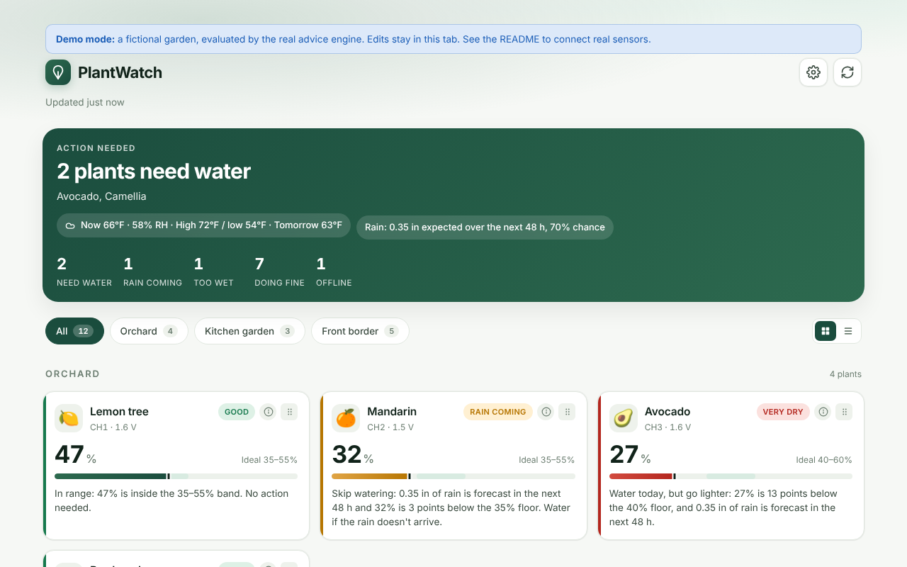
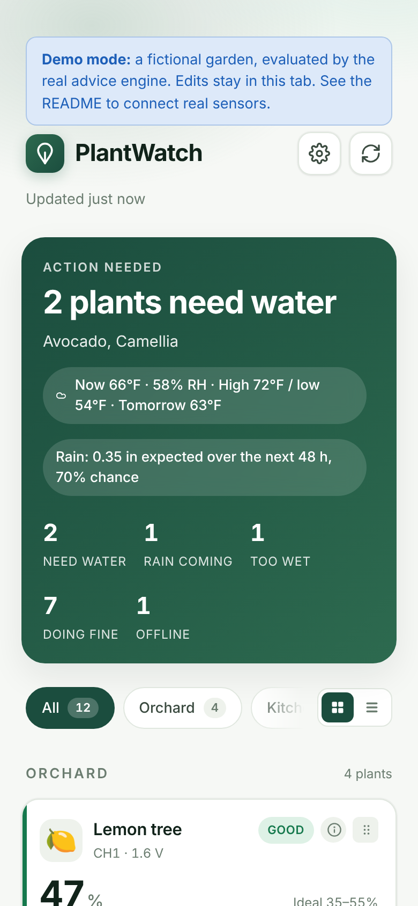
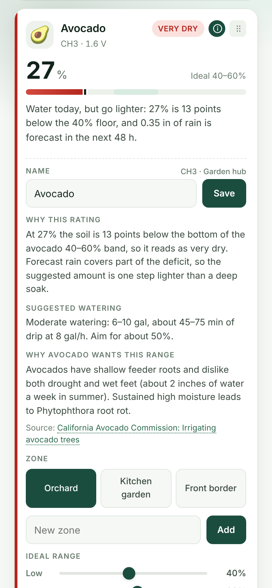
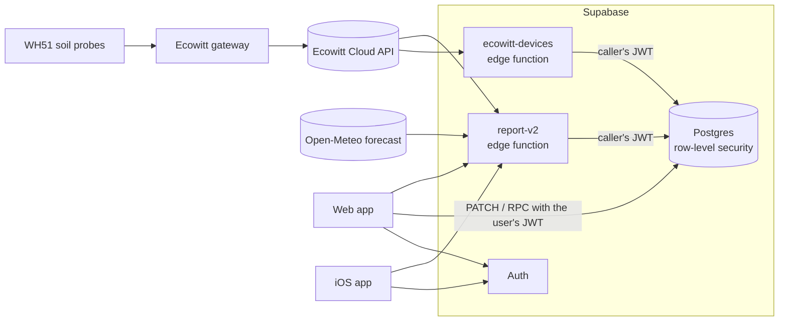

# PlantWatch

PlantWatch turns readings from Ecowitt soil-moisture sensors into per-plant watering advice. Each sensor is mapped to a plant, each plant gets a moisture range for its species, and the backend combines the live reading with the next 48 hours of forecast rain to say whether to water today, how much, or whether to leave it to the rain. It runs on Supabase (Deno edge functions, Postgres with row-level security, Auth) with a dependency-free web app and a SwiftUI iOS app. I built it for my family's garden and then made it multi-user, so anyone with Ecowitt sensors can sign up, enter their Ecowitt API keys and name their sensors.

<p>
  
</p>
<p>
  
  &nbsp;
  
</p>

The screenshots show demo mode: a fictional garden with sample readings, evaluated by the real advice engine.

## Try the demo

No account or backend needed:

```sh
python3 -m http.server --directory web 8080
# open http://localhost:8080        (no config.js, so it starts in demo mode)
# or   http://localhost:8080/?demo=api-error   to see how a rejected Ecowitt key is reported
```

In demo mode everything is interactive (renaming, moving plants between zones, editing ranges, reordering), but changes stay in the browser tab.

## How it works



1. A client calls `report-v2` with the signed-in user's JWT.
2. The function checks the token with Supabase Auth, then reads the user's Ecowitt keys, gateways, zones, plants and preferences through PostgREST **with the same JWT**, so row-level security limits every query to that user's rows.
3. It fetches live readings from Ecowitt (one request per gateway) and the forecast from Open-Meteo in parallel, and looks up a "last seen" time for any sensor that is not reporting.
4. A pure, typed advice engine (`backend/supabase/functions/_shared/advice.ts`) evaluates each plant and the function returns one JSON report that both clients render.

The web client edits plant settings directly in Postgres (PATCH and RPC calls under the user's JWT). It re-evaluates an edited plant instantly with a browser build of the same engine, so the advice on screen and the advice from the server cannot disagree. More detail, including the data model and report format, is in [docs/architecture.md](docs/architecture.md).

## How the advice works

Each plant has an ideal moisture band: its species' default, or a custom range set in the app. The gap is how many percentage points the reading sits below the band's floor (readings are rounded to whole percent first, so what is displayed is what is judged).

| Reading                    | Status     | Advice                                                                         |
| -------------------------- | ---------- | ------------------------------------------------------------------------------ |
| Inside the band            | Good       | No action                                                                      |
| Above the band             | Too wet    | Hold off and let it dry (and check drainage if more rain is coming)            |
| 1-4 points below the floor | Dry        | Light watering                                                                 |
| 5-9 points below           | Dry        | Moderate watering                                                              |
| 10 or more points below    | Very dry   | Deep soak                                                                      |
| Sensor silent              | No reading | When it last reported, and what to check                                       |
| Gateway or API failure     | No data    | Why the gateway couldn't be read (for example "Ecowitt rejected the API keys") |

The forecast can change the advice for dry plants:

- **Dry** (under 10 points below): if at least **0.25 in** of rain is forecast in the next 48 hours, the status becomes _Rain coming_ and watering is skipped ("water if the rain doesn't arrive").
- **Very dry**: watering is only skipped for at least **0.5 in** of rain within 24 hours. If 0.25 in or more is forecast within 48 hours, the advice drops from a deep soak to a moderate watering.
- If the forecast reports a precipitation probability and its highest value over the 48 hours is below **50%**, forecast rain is ignored.
- Rain totals come from Open-Meteo's hourly forecast, summed over the hours ending in the next 24 and 48 hours.

These thresholds are conservative defaults, not agronomic constants. They live in one `THRESHOLDS` object and are covered by tests.

**How much water.** Amounts are set in gallons by plant size and watering level. Run times are derived from them, assuming 2 gal/h drip emitters: one for a small plant, two for a medium shrub and four for a large tree (minutes = gallons ÷ gal/h × 60, rounded to 5 minutes). The advice aims for the middle of the band to leave a buffer.

| Plant size | Drip rate | Light                 | Moderate              | Deep soak              |
| ---------- | --------- | --------------------- | --------------------- | ---------------------- |
| Small      | 2 gal/h   | 0.5–1 gal (15–30 min) | 1.5–3 gal (45–90 min) | 3–5 gal (90–150 min)   |
| Medium     | 4 gal/h   | 1–2 gal (15–30 min)   | 4–6 gal (60–90 min)   | 6–10 gal (90–150 min)  |
| Large      | 8 gal/h   | 2–4 gal (15–30 min)   | 6–10 gal (45–75 min)  | 12–18 gal (90–135 min) |

<details>
<summary>Species ranges and sources</summary>

| Type                          | Ideal band | Size   | Source                                                                                                                                              |
| ----------------------------- | ---------- | ------ | --------------------------------------------------------------------------------------------------------------------------------------------------- |
| Citrus (orange, lemon, lime…) | 35–55%     | large  | [UC IPM: Citrus watering](https://ipm.ucanr.edu/PMG/GARDEN/FRUIT/CULTURAL/citruswatering.html)                                                      |
| Avocado                       | 40–60%     | large  | [California Avocado Commission](https://www.californiaavocadogrowers.com/cultural-management-library/irrigating-avocado-trees)                      |
| Camellia                      | 35–50%     | medium | [UC Master Gardeners: Camellia](https://ucanr.edu/blog/uc-master-gardeners-diggin-it-slo/article/camellia)                                          |
| Hydrangea                     | 40–60%     | medium | [Missouri Botanical Garden](https://www.missouribotanicalgarden.org/PlantFinder/PlantFinderDetails.aspx?taxonid=286874)                             |
| Rosemary                      | 18–35%     | small  | [UC Master Gardeners: Rosemary](https://sonomamg.ucanr.edu/Plant_of_the_Month/Rosemary)                                                             |
| Lavender                      | 20–38%     | small  | [UC Master Gardeners: Lavandula](https://ucanr.edu/site/uc-master-gardener-program-sonoma-county/lavandula-lavender)                                |
| Westringia (coast rosemary)   | 20–38%     | small  | [UC Master Gardeners: Westringia](https://ucanr.edu/site/uc-marin-master-gardeners/article/westringia-every-garden)                                 |
| Bay laurel                    | 22–40%     | medium | [UC Master Gardeners: Laurus nobilis](https://sonomamg.ucanr.edu/Plant_of_the_Month/Laurus_nobilis_Saratoga/)                                       |
| Star jasmine                  | 30–50%     | medium | [UC IPM: Star jasmine](https://ipm.ucanr.edu/PMG/GARDEN/PLANTS/starjasmine.html)                                                                    |
| Boxwood                       | 28–50%     | medium | [UC Master Gardeners: Drought watering](https://ucanr.edu/site/uc-master-gardener-program-alameda-county/thirsty-plants-and-watering-times-drought) |
| Convolvulus (silverbush)      | 20–40%     | small  | [UC IPM: Bush morning glory](https://ipm.ucanr.edu/PMG/GARDEN/PLANTS/bushmorngl.html)                                                               |
| Other / not sure              | 25–45%     | medium | Generic moderate-water band                                                                                                                         |

Earlier versions of the project had three copies of this table that disagreed. The engine keeps the bands the deployed report used, which had lower floors for the fruit trees than the first research pass (citrus 35–55% rather than 40–60%, avocado 40–60% rather than 45–65%).

</details>

## Security model

- **Tenant isolation is enforced by Postgres, not by the functions.** The edge functions never use the service-role key; they forward the caller's JWT to PostgREST, so RLS policies (`user_id = auth.uid()`) decide what each request sees. Tests check that every database request carries the caller's token.
- **Ownership checks across tables.** A plant can only reference the caller's own gateway and zone. Without this, a user could attach plants to another user's gateway and, because each gateway channel is unique, block that user from configuring it.
- **No self-granted admin.** Clients can update only `profiles.onboarded`; a column grant and a trigger both reject changes to `is_admin`.
- **Atomic, idempotent onboarding.** `complete_onboarding()` is a `SECURITY DEFINER` function with an empty `search_path`. It validates the whole payload, then upserts gateways, zones and plants and marks the profile onboarded in one transaction, so a failure leaves nothing half-written and a retry is safe. `anon` cannot call it.
- **Failures are explicit.** A rejected Ecowitt key is reported as such rather than as every sensor being offline, and database errors return 502 rather than sending the user back to onboarding.
- **Web client hardening.** A Content-Security-Policy with no inline scripts, HTML-escaping of every server and sensor string (checked with an injection payload in browser tests), and no third-party requests (fonts are self-hosted). The user is signed out only when Supabase rejects the refresh token, not when the network blips.
- **Location privacy.** Forecast coordinates are rounded to 0.01° (about 1 km) before they are sent to Open-Meteo.

The database tests in [`backend/supabase/tests/db_test.ts`](backend/supabase/tests/db_test.ts) run the real migrations against Postgres (PGlite, compiled to WebAssembly) as the `authenticated` and `anon` roles, so these policies are exercised, not just written. One test applies only the original migration and shows that the cross-tenant insert and the admin self-grant succeed there; the others show they are rejected now.

## Project layout

```
backend/supabase/
  functions/
    _shared/          advice engine, report builder, Ecowitt and Open-Meteo clients (+ *_test.ts)
    report-v2/        GET: the signed-in user's report
    ecowitt-devices/  POST: validate Ecowitt keys, list gateways and active channels
  migrations/         schema, RLS policies, complete_onboarding(), set_plant_order()
  tests/db_test.ts    migrations + RLS + RPC tests on PGlite
  config.toml
web/                  static web app, no build step
  js/                 app.js (dashboard), auth.js (sign-in, onboarding), api.js, supabase.js,
                      engine.js (generated), demo-fixture.js
  config.example.js   copy to config.js (gitignored)
ios/                  SwiftUI app (iOS 17+); Secrets.example.xcconfig -> Secrets.xcconfig
scripts/              build_web_engine.ts: bundles the engine for the browser
e2e/                  Playwright browser tests (demo mode, and live mode against a mocked API)
docs/                 architecture.md, sensors.md, screenshots/
```

## Setup

You need a Supabase project, the [Supabase CLI](https://supabase.com/docs/guides/cli) and [Deno](https://deno.com) 2.x.

**1. Database and functions**

```sh
cd backend
supabase link --project-ref <your-project-ref>
supabase db push                                   # applies supabase/migrations/
supabase functions deploy report-v2
supabase functions deploy ecowitt-devices
```

No function secrets are needed. Supabase provides `SUPABASE_URL` and `SUPABASE_ANON_KEY` to every function, and each user's Ecowitt keys are stored in their own `ecowitt_accounts` row during onboarding. Apply the migrations before using the web client: it relies on `complete_onboarding()` and the newer columns. (`report-v2` itself tolerates being deployed first.)

**2. Web app**

```sh
cp web/config.example.js web/config.js   # fill in the project URL and anon key
python3 -m http.server --directory web 8080
```

`web/` is static and can be hosted anywhere (GitHub Pages, Cloudflare Pages, Netlify, an S3 bucket). The Content-Security-Policy in `index.html` allows `*.supabase.co` and localhost; a self-hosted Supabase on another domain needs adding to its `connect-src`.

**3. iOS app**

```sh
cp ios/Secrets.example.xcconfig ios/Secrets.xcconfig   # fill in the URL and anon key
open ios/PlantWatch.xcodeproj
```

Select your development team under Signing & Capabilities. The bundle id is `com.plantwatch.app`; change it to one you own before distributing.

**4. First run.** Create an account, enter the Application Key and API Key from your ecowitt.net account, then name each sensor and pick its plant type and zone. The forecast uses the gateway's location from Ecowitt; to use a different location, set `weather_lat` and `weather_lon` in your `user_prefs` row.

For local development, `supabase start` and `supabase functions serve` run the whole backend in Docker; point `web/config.js` at `http://127.0.0.1:54321`.

## Tests

```sh
deno task verify     # format check, lint, type-check, all Deno tests
deno task test:unit  # advice engine, Ecowitt and forecast parsing, both function handlers
deno task test:db    # migrations, RLS policies and RPCs on PGlite
deno task build:web  # rebuild web/js/engine.js after changing the engine

cd e2e && npm ci && npx playwright install chromium && npx playwright test   # browser tests
```

- **Unit tests** cover threshold boundaries, forecast deferral, the minutes/gallons arithmetic, per-plant overrides, Ecowitt error classification, the report shape the iOS app decodes, and the handlers' authentication and JWT forwarding.
- **Database tests** apply the migrations to PGlite and act as the `authenticated` and `anon` roles: tenant isolation, ownership checks, the admin flag, onboarding atomicity and idempotency, and the iOS client's older write path.
- **Browser tests** (Playwright, in `e2e/`) run the web client in demo mode, and in live mode against a mocked Supabase API: range edits re-evaluated by the engine, HTML escaping, zone moves, keyboard and pointer reordering, onboarding through the RPC, the exact PATCH payloads and tokens, and the session rules.

GitHub Actions ([`.github/workflows/ci.yml`](.github/workflows/ci.yml)) runs all three, checks formatting, lint and types, and verifies that the committed browser bundle matches the TypeScript source.

## Known limitations

**iOS app.** The iOS client has not been updated to match the web client yet, and it is not built in CI.

- Session tokens are stored in `UserDefaults` rather than the Keychain. Being offline no longer signs the user out, but any error response to a token refresh (including a server error) still does.
- Plant names, ranges, zones, order and alert choices edited on iOS are stored on the device only, and the zone filter chips are fixed to three zone names (plants in other zones still appear under "All").
- Onboarding uses four separate REST writes instead of `complete_onboarding()`; a retry after a partial failure can stop with a conflict.

**Backend.**

- Ecowitt keys are stored in plaintext in Postgres, readable only by their owner through RLS. Supabase Vault would be better.
- Every report request calls Ecowitt and Open-Meteo; there is no caching or rate limiting yet.
- Soil-moisture percentages depend on soil type and probe placement, so the species bands are starting points; per-plant ranges exist for that reason.
- US units only (°F, inches, gallons).

**Web app.** Alerts are browser notifications that fire only while the dashboard is open, and there is no service worker, so the app needs a connection.

## Roadmap

- Bring the iOS app in line with the web client: Keychain storage, the same refresh rules, settings saved to the database, onboarding through the RPC, zones from the report.
- A scheduled function that stores readings, for drying-rate trends and push notifications that do not need an open app.
- Heat and evapotranspiration in the advice, not just rain.
- Ecowitt keys in Supabase Vault.
