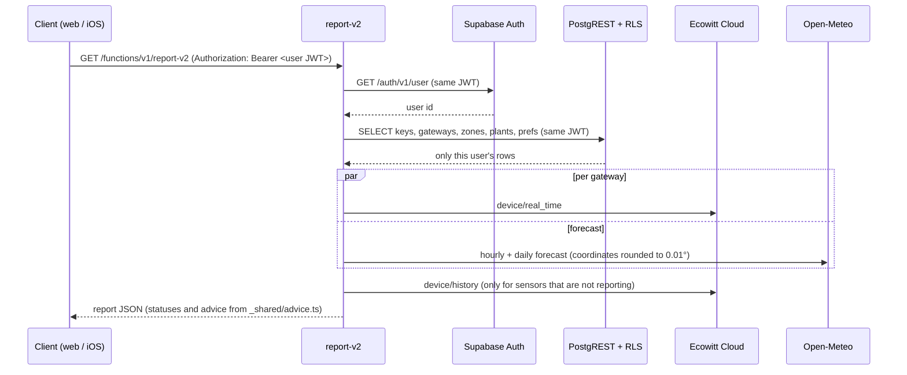

# Architecture

PlantWatch has three parts: two Supabase Edge Functions (Deno), a Postgres schema protected by row-level security (RLS), and two clients (a static web app and a SwiftUI iOS app). This page describes how they fit together. The README covers setup.

## Request flow



The functions never use the service-role key. Every database request carries the caller's JWT, so Postgres evaluates RLS policies as that user. A bug in a query can return too little, but not another user's rows.

## Data model

All tables live in `public` and have RLS enabled. `user_id` references `auth.users` with `on delete cascade`, so deleting an account removes its data.

| Table              | Holds                                                                                             | Client access (RLS)                                                                       |
| ------------------ | ------------------------------------------------------------------------------------------------- | ----------------------------------------------------------------------------------------- |
| `profiles`         | One row per user: `onboarded`, `is_admin` (reserved, unused by the clients)                       | Read own row; update only `onboarded`. A trigger rejects `is_admin` changes from clients. |
| `ecowitt_accounts` | The user's Ecowitt application key and API key                                                    | Own row                                                                                   |
| `gateways`         | Ecowitt gateways: MAC, name, station type, and (from Ecowitt) latitude, longitude, time zone      | Own rows                                                                                  |
| `zones`            | User-defined groups such as "Orchard"; unique per user by name                                    | Own rows                                                                                  |
| `plants`           | One soil channel: gateway, channel 1-16, name, species, zone, optional ideal range, order, alerts | Own rows, and `gateway_id` / `zone_id` must point at the caller's own gateway and zone    |
| `user_prefs`       | Alert mode, offline alerts, optional forecast location override, layout                           | Own row                                                                                   |

A trigger on `auth.users` creates the `profiles` and `user_prefs` rows at sign-up.

The ownership check on `plants` matters because `(gateway_id, channel)` is unique across all users: without it, a user could attach plants to someone else's gateway and block that user from configuring those channels. `backend/supabase/tests/db_test.ts` covers this, along with admin self-grant, cross-user reads and updates, and onboarding atomicity.

## Edge functions

Both functions are thin handlers around shared modules in `backend/supabase/functions/_shared/`:

| Module        | Responsibility                                                                                                      | I/O              |
| ------------- | ------------------------------------------------------------------------------------------------------------------- | ---------------- |
| `advice.ts`   | Species table, thresholds, watering amounts, `assessPlant()`                                                        | none             |
| `report.ts`   | Turns rows, sensor results and the forecast into the report JSON; `reassess()` for client-side edits                | none             |
| `ecowitt.ts`  | Ecowitt API v3 client. Failures become typed `SourceError`s (`auth`, `device`, `api`, `http`, `network`, `timeout`) | fetch (injected) |
| `forecast.ts` | Open-Meteo request and summary (rain in the next 24 h / 48 h, highest precipitation probability)                    | fetch (injected) |
| `supabase.ts` | Auth user lookup and a PostgREST client bound to the caller's JWT                                                   | fetch (injected) |
| `http.ts`     | CORS and JSON responses                                                                                             | none             |

Handlers take `fetch`, the environment and a clock as parameters, which is how the tests exercise them without a network.

**`report-v2`** (`GET`) returns the signed-in user's report, or `{ needs_onboarding: true }` when they have no Ecowitt keys or no plants. If a gateway cannot be read (for example because Ecowitt rejects the keys), its plants report `status: "no_reading"` with `headline: "No data"` and an `offline_cause` explaining why, and the report lists the failure in `source_errors`. A sensor that is simply silent gets `last_seen` from Ecowitt's history API instead.

**`ecowitt-devices`** (`POST { app_key, api_key, save }`) validates Ecowitt keys by listing the account's gateways, returns each gateway's active soil channels for the setup screen, and with `save: true` stores keys that worked.

### Report shape

The report stays compatible with the iOS client's `Codable` models; fields added later are ignored by older clients. Abridged:

```jsonc
{
  "generated_at": "2026-10-06T12:00:00.000Z",
  "weather": {
    "available": true,
    "temp_now_f": 66,
    "rain_next_48h_in": 0.35,
    "rain_probability_48h": 70 /* … */
  },
  "counts": { "needs_water": 2, "too_wet": 1, "good": 7, "missing": 1, "waiting_for_rain": 1 },
  "zones": [{ "id": 1, "name": "Orchard", "sort": 0 }],
  "readings": [{
    "plant_id": 3,
    "zone_id": 1,
    "zone": "Garden hub",
    "channel": 3,
    "name": "Avocado",
    "type": "avocado",
    "moisture": 27,
    "ideal_low": 40,
    "ideal_high": 60,
    "custom_range": false,
    "status": "very_dry",
    "headline": "Very dry",
    "needs_water": true,
    "advice": "Water today, but go lighter: 27% is 13 points below the 40% floor, and 0.35 in of rain is forecast in the next 48 h.",
    "watering": {
      "level": "moderate",
      "gallons_low": 6,
      "gallons_high": 10,
      "minutes_low": 45,
      "minutes_high": 75,
      "drip_rate_gph": 8,
      "target_pct": 50
    },
    "offline_cause": null,
    "last_seen": null
  }],
  "source_errors": [],
  "species_catalog": [
    { "key": "citrus", "label": "Citrus (orange, lemon, lime…)", "low": 35, "high": 55 }
  ]
}
```

`zone` is the gateway name: the iOS client keys its local preferences on gateway name plus channel. Statuses are limited to values the iOS `Status` enum knows (`very_dry`, `dry`, `dry_rain_coming`, `good`, `too_wet`, `no_reading`), because an unknown value would fail decoding of the whole report.

## Onboarding

1. The client calls `ecowitt-devices` with the user's keys. Keys are saved only after Ecowitt accepts them.
2. The user names each discovered channel, picks a species and a zone.
3. The client calls `complete_onboarding(p_gateways, p_plants)` once.

`complete_onboarding` is `SECURITY DEFINER` with `search_path = ''`. It identifies the caller with `auth.uid()` and only ever writes that user's rows. Inside one transaction it validates the whole payload (channels 1-16, species key format, every plant on one of the caller's gateways, no duplicate channels), then upserts gateways on `(user_id, mac)`, zones on `(user_id, name)` and plants on `(gateway_id, channel)`, and marks the profile onboarded. Re-running it with the same input changes nothing, so a retry after a dropped connection is safe. A per-user advisory lock serialises double submits. `anon` cannot execute it.

The iOS client still onboards with four separate REST writes (see Known limitations in the README). The migration is additive, and the database tests check that those writes keep working under the new policies.

## Clients

**Web** (`web/`) is plain HTML, CSS and JavaScript with no build step of its own. `web/js/engine.js` is a browser bundle of `advice.ts` and `report.ts`, generated by `deno task build:web` and checked for freshness in CI. The web client uses it to re-evaluate a plant immediately when its range changes, and demo mode uses it to build reports from `web/js/demo-fixture.js`. Settings are written to `plants` and `user_prefs` with PATCH requests, and card order with the `set_plant_order` RPC, all under the user's JWT.

Session handling: the access token is refreshed shortly before it expires, concurrent refreshes share one request, and a `401` triggers one refresh and retry. The user is signed out only when Supabase rejects the refresh token. Network errors and `5xx` responses keep the session.

**iOS** (`ios/`) is SwiftUI, iOS 17+. It reads the same report and calls the same functions. Its Supabase URL and anon key come from `Secrets.xcconfig` through Info.plist.

## Privacy notes

- Forecast coordinates are rounded to 0.01° (about 1 km) before they are sent to Open-Meteo.
- The web app loads nothing from third parties (fonts are self-hosted) and its Content-Security-Policy allows scripts only from its own origin.
- Ecowitt keys are stored in Postgres in plaintext, readable only by their owner through RLS. Moving them to Supabase Vault is on the roadmap.
