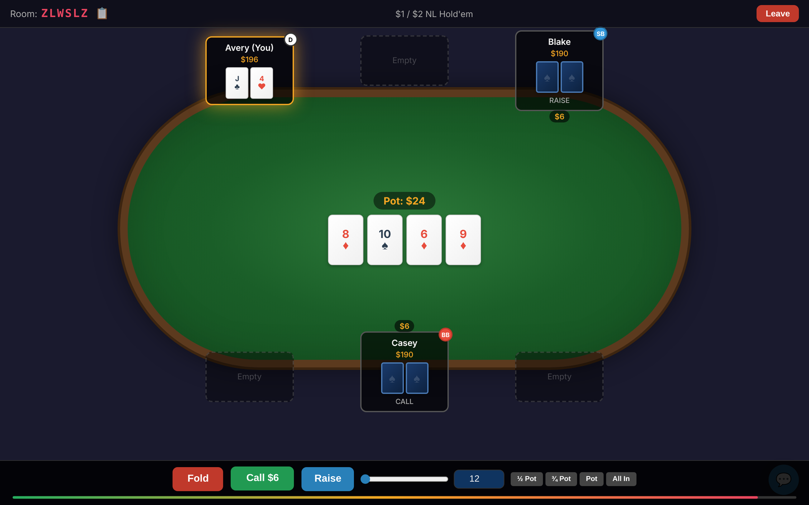
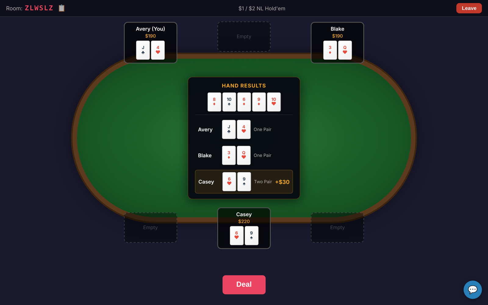
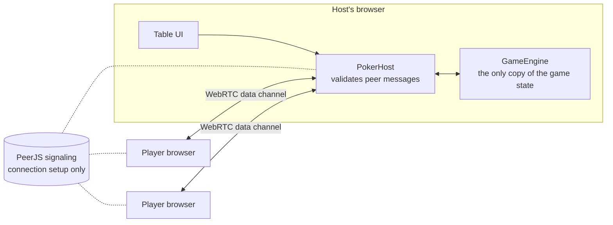

# Poker Room

No-limit Texas Hold'em for up to six players, peer to peer in the browser. One player creates a
table and shares a six-character room code; everyone else joins with it. There is no game
server: the host's browser runs the game engine and talks to the other players over WebRTC
data channels.





## How it works



- **Rooms.** A room code maps to a PeerJS id (`poker-room-<CODE>`). The signaling server is only
  used to set up connections; STUN handles NAT traversal, and game traffic then flows directly
  between browsers.
- **Host-authoritative.** Players send intents (`sit`, `action`, `chat`). The host validates each
  one, applies it to the engine, and broadcasts the resulting events. Clients never compute game
  state, so a tampered client can't award itself a pot.
- **Private cards stay private from other players.** Hole cards are sent only to their owner, and
  the acting player is taken from the connection a message arrived on, never from the message.

## The engine

Everything in [`src/game`](src/game) is plain TypeScript with no DOM or network dependencies,
which is what makes it testable.

- **Betting rounds.** A round ends only when every player who can still bet has acted and matched
  the current bet. A raise reopens the action for everyone who called before it, and the big blind
  keeps the option to raise when the action is limped around to them.
- **Positions by seat, not by array index.** The button moves to the next occupied seat even when
  the previous dealer busts, blinds and first-to-act are worked out from seat numbers, and the
  player whose turn it is is tracked by id, so people sitting down or disconnecting mid-hand can't
  shift the turn. Heads-up play follows the heads-up rules (the button posts the small blind,
  acts first before the flop and last after it).
- **Pots.** Before pots are built, any part of a bet nobody matched is returned to the bettor.
  The rest is layered into a main pot and side pots by how much each live player put in; folded
  players' chips stay in the layers they reached. Each pot goes to the best hand among the players
  eligible for it, ties split it, and the odd chip goes to the first winner left of the button.
- **Hand evaluation.** Every 5-card combination of the 7 available cards is ranked, with full
  tiebreaks (kickers, the wheel as the lowest straight, the board playing for everyone).
- **Shuffling.** Fisher–Yates over `crypto.getRandomValues`, with rejection sampling so no card
  position is more likely than another (a plain modulo would favor low values).
- **Timeouts.** Each decision has 30 seconds. On timeout the player checks if that's free and
  folds otherwise.
- **Untrusted input.** Every message from a peer goes through
  [`parsePeerMessage`](src/network/messages.ts) before the host acts on it: chip amounts must be
  whole, non-negative numbers, actions and seats must be valid, and names and chat are
  length-capped and stripped of control characters. The engine separately re-checks every
  action against the moves that player actually has, and an invalid action changes nothing,
  including the turn timer.

## Testing

`npm test` runs 44 tests with Vitest:

- Hand rankings for every category, plus kickers, the wheel, and ties when the board plays.
- Betting order before and after the flop, raises reopening the action, and rejection of
  malformed or out-of-range bets.
- Side pots, uncalled bets, split pots and the odd chip, using stacked decks to deal exact hands.
- Seating edge cases: a busted dealer, a player joining mid-hand, a disconnect that leaves one
  player.
- A seeded fuzz test that plays 600 hands of random legal actions on random tables (2–6 players,
  random stacks) and checks after every hand that no chips were created or lost and that the hand
  finished cleanly.

CI runs the type check, the tests and a production build on every push.

## Trust model and limitations

- **The host can see every hole card**, because the engine runs in their browser. That's fine
  for a game among friends. Making it cheat-proof against the host would take a cryptographic
  shuffle (mental poker) or a neutral server.
- **No TURN server.** Players behind strict NATs may not be able to connect; adding a TURN server
  to the ICE configuration in [`connection.ts`](src/network/connection.ts) fixes that.
- **The game ends if the host leaves.** There is no host migration.
- Blinds are fixed at $1/$2 with a $200 buy-in, and there are no rebuys.
- An all-in that is smaller than a full raise reopens the betting for players who already acted.
  Casino rules say it shouldn't.

## Running it

```sh
npm install
npm run dev        # http://localhost:3000 — open it in two windows: create a table in one, join from the other
npm test
npm run build      # type-check, then build to dist/
npm run deploy     # build and publish dist/ to Cloudflare Pages with Wrangler
```

Requires Node 22. The dev server and the deployed site both use the public PeerJS signaling
server, so playing needs an internet connection.

## Layout

```
src/game/       engine, hand evaluator, deck and types (no DOM, no network)
src/network/    PeerJS host and client, message validation
src/ui/         table rendering and the action bar
src/test/       test helpers: card parsing, stacked decks, a seeded PRNG
```
